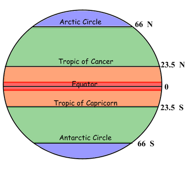

# Research Question 

  Our project delves into the question of whether there is a correlation between climate and human population movement. When looking at reasons why people choose to live in certain locations, it is important to consider all contributing factors. To represent the *climate* factor in this data exploration will be '*sunshine*' and '*latitude*' related variables. To represent *human population movement* there will be '*tourism*' and '*population*' related variables.  
  Seasonal depression and mood-changes due to weather and climate patterns can have a serious impact on peoples' lives. Applying this knowledge, climate could be associated with certain locations having increased populations or tourism traffic. 


# Data Processing 

## Data Intake 

### Loading in Basic Packages

```{r}
library(tidyverse)
library(rvest)
library(dplyr)
```


##### Sunshine Hours Data

- The *sunshine* data has 392 cases of individual cities across the world and the number of sunshine hours they get for each month of the year. The data also contains the country each city resides in and the total number of hours of sunshine per year. 
```{r}
sunshine <- read.csv(file = 'Sunshine hours for cities in the world.csv')

str(sunshine)
head(sunshine)
sample_n(sunshine, 10)
nrow(sunshine)
```


##### City Latitude/Longitude Data

- The original data set I downloaded was too big for GitHub, so I had to process and wrangle the data in a seperate RScript, save the new csv file and then import it here. I will include images of the coding work I did.

- This data set is the already wrangled version (image of the wrangling done below in *Data Wrangling* section).
```{r}
city_loc <- read_csv(file="city_loc.csv")

str(city_loc)
sample_n(city_loc, 10)
nrow(city_loc)
head(city_loc)
```  


##### Country Tourism Data

- Another interesting observation about a country and its sunshine hours pertains to tourism rates. If a country is more desirable (by having more sunshine hours [?]) it will bring in more tourists. This data measures the amount of tourism dollars spent in different countries over the course of many years (in US dollars).
```{r}
country_tour <- read.csv("tourism-recipts.csv")

str(country_tour)
sample_n(country_tour, 10)
nrow(country_tour)
head(country_tour)
```


##### City Population Data

- This data set contains city and country name as well as the population of 2022, 2023, growth rate, type (world versus USA), and rank (1 being the most populated city, 778 being the least populated). We plan on using this this table to see the correlation between the amount of sunshine a city gets and its population. We will be using the growth rate so that regardless of the different sizes of cities, we can evaluate the changes in population equally.
```{r}
CityPopulations <- read_csv(file = "world-city-listing.csv")

str(CityPopulations)
head(CityPopulations)
sample_n(CityPopulations, 10)
nrow(CityPopulations)
```


## Data Wrangling 

Include R code and written explanation for wangling your data (you can make multiple wrangled data sets). 

##### Sunshine Hours Data

- The original data *sunshine* is already pretty clean data and did not need much wrangling on its own, however there is data we can manipulate for later usage. 
- I created *sunshine_seasons* which contains the total number of hours for (roughly) each season. Technically seasons tend the start in the middle of a month, so I had to do come approximation on how I split the seasons up. 
```{r}
sunshine_seasons <-
  sunshine %>%
  mutate(Winter=Jan+Feb+Mar, Spring=Apr+May+Jun, Summer=Jul+Aug+Sep, Fall=Oct+Nov+Dec) %>%
  select(Country, City, Winter, Spring, Summer, Fall)

sunshine_seasons
```


##### City Latitude/Longitude Data

- This data contains a lot of information that is not needed for our purposes: there are extraneous variables and cases that are duplicated to makeup for different spellings of cities. To eliminate this extra data, I will use **select()** to keep only the columns we need and join the table with the *CityPopulations1* cities to only keep the cities we need.


- Although the tables are now joined, the *city_loc* data contained multiple locations for many of the cities, presumably to represent different corners of each. To combat this, I will take the average of the longitude and latitude for each city and use the new numbers as the primary location for each city.
```{r}
city_loc <-
  city_loc %>%
  group_by(City) %>%
  mutate(Longitude = mean(Longitude), Latitude = mean(Latitude)) %>% # get the average location
  select(City, Longitude, Latitude) %>%
  distinct() # remove repeated cities, so each city appears one time
```



- In the graphic the lines for different latitude subsections are shown. I will be using these to split up countries. *tropical* is anywhere from lat -23.5 to 23.5, *moderate* is from -23.5 to -66 and 23.5 to 66 and *poles* will be the rest.
```{r}
city_loc <-
  city_loc %>%
  na.omit()

for(i in 1:length(city_loc$Latitude)){
  if((city_loc$Latitude[i]>=(-23.5)) && (city_loc$Latitude[i]<=23.5)){
    city_loc$climate[i] = "tropical"
    }
  else if(city_loc$Latitude[i]>=(-66) && city_loc$Latitude[i]<(-23.5) || city_loc$Latitude[i]<=(66) && city_loc$Latitude[i]>(23.5)){
    city_loc$climate[i] = "moderate"
    }
  else city_loc$climate[i] = "poles"
}
```

- Now we know the precise locations of the cities, which will be useful to group cities by their locations (and thus sunshine hours and climate) and compare data from there.


##### Country Tourism Data

- After in taking the data, some things that need adjustment in the data: pick only one year to use for the tourism income (to cut down on the data), rename the variables, get rid of the country codes and divide the values into smaller numbers, since they are quite large.
```{r}
country_tour <-
  country_tour %>%
  rename(income='value_.') %>%
  select(name, year, income) 
```


- In order to find the most useful year, I am going to **group_by()** year and find a year that is relatively recent (>=2015) and contains the most countries with data for that year.
```{r}
country_tour %>%
  filter(year >= 2015) %>%
  group_by(year) %>%
  summarise(num_of_countries = n()) #count the number of countries with data for each year
```


- From here, we can see the most useful year for these purposes will be 2016. Now the *country_tour* can be shrunk down.
```{r}
country_tour <-
  country_tour %>%
  filter(year == 2016)

sample_n(country_tour,10)
```

```{r}
country_tour<-
  country_tour %>%
  mutate(income = as.integer(income/100000)) %>%
  rename("tourism income (by 100,000)" = income, Country=name)

sample_n(country_tour,10)
```

- After dividing the income by $100,000 and renaming the variable, this data is ready for use.


##### City Population Data

- I renamed the variables so that they are easier to read. I, then, selected only the variables that we will be needing to evaluate the population growth rate of a city (country and growth rate).
```{r}
CityPopulations1 <-
  CityPopulations %>%
    mutate(Country = country, City = city, Population2023 = pop2023, GrowthRate = growthRate) %>%
    select(Country, GrowthRate)

sample_n(CityPopulations1,10)
```


## Data Visualization

Include R code and written explanation for your data visualization(s) with at least 3 variables. You must have **at least** one graph. You may have more than one (I would encourage you to have more than one). 

```{r}

sunshine_graph_data %>% #use sunshine for left_join, since it contains less countries than CityPopulations1
  left_join(CityPopulations1) %>%
  na.omit() %>%
  ggplot() + 
  geom_point(aes(x= GrowthRate, y= sun_hours_year, color = type)) +
  ggtitle("Population Growth Rate vs. Latitude") +
  xlab("Population Growth Rate") +
  ylab("Total Hours of Sunshine per Year")

```

```{r}

latitude_graph_data <-
  sunshine %>%
  mutate(City = tolower(City)) %>% #to make city names match those in city_loc_types
  left_join(city_loc_types) %>% # join the tables
  group_by(Country) %>%
  mutate(sun_hours_year = mean(Year)) %>% # find the average sunshine hours per year per country
  select(Country, Latitude, type, sun_hours_year) %>%
  distinct() %>%
  na.omit()

latitude_graph_data %>%
  left_join(CityPopulations1) %>%
  na.omit() %>%
  ggplot() + 
  geom_point(aes(x= Latitude, y= GrowthRate, color = type)) +
  ylab("Population Growth Rate") +
  ggtitle("Population Growth Rate vs. Latitude") +
  geom_smooth(method = "glm" , 
              formula = y ~ poly(x, 4),             
              aes(x = Latitude, y = GrowthRate), 
              color = "purple")

```

## Conclusion

Answer your research question using the data sets and visualizations you created. 


